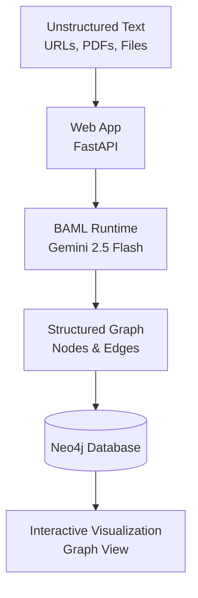

# Knowledge Graph Extractor - Web App

  

A simple, beautiful web application for extracting and visualizing knowledge graphs from unstructured text. Built with BAML (Boundary Abstract Model Language), Gemini 2.5 Flash, and Neo4j.

## Architecture



- **Input**: Unstructured web pages, PDFs, or text documents
- **Processor**: BAML with Gemini 2.5 Flash for structured extraction
- **Storage**: Neo4j graph database
- **Interface**: Web-based visualization for exploring knowledge graphs

## Prerequisites

- [uv](https://github.com/astral-sh/uv) - Fast Python package installer (install with `curl -LsSf https://astral.sh/uv/install.sh | sh`)
- Python 3.13 (uv will install this automatically with `uv sync`)
- Docker and Docker Compose
- Google AI API Key ([Get one here](https://aistudio.google.com/))

## Setup

### 1. Install Dependencies

```bash
pip install -e .
```

### 2. Install BAML CLI and Runtime

```bash
pip install baml-py baml-cli
```

Or using npm:
```bash
npm install -g @boundaryml/baml-cli
```

### 3. Generate BAML Client

After installing BAML CLI, generate the Python client:

```bash
baml-cli generate
```

This will create the `baml_client` directory with type-safe Python bindings.

> **Note:** The BAML client is automatically generated from `baml_src/clients.baml` and `baml_src/main.baml`. If you have the VS Code BAML extension installed, it will auto-generate on save.

### 3. Set Environment Variables

Create a `.env` file in the project root:

```bash
echo "GEMINI_API_KEY=your-api-key-here" > .env
```

Or manually create `.env` with:
```
GEMINI_API_KEY=your-api-key-here
```

> **Note:** Get your API key from [Google AI Studio](https://aistudio.google.com/). The app will automatically load it from the `.env` file using python-dotenv.

### 4. Start Neo4j with Docker

```bash
docker-compose up -d
```

This will start Neo4j on:
- HTTP: http://localhost:7474
- Bolt: bolt://localhost:7687
- Default credentials: `neo4j` / `password`

## Usage

### Start the Web App

Simply run:

```bash
uv run python app.py
```

Or using uvicorn directly:

```bash
uv run uvicorn app:app --reload
```

Then open your browser to: **http://localhost:8000**

### Using the Web Interface

1. **Enter Text or URL**: Paste your text directly or enter a URL to extract from
2. **Upload a File**: Upload a `.txt`, `.html`, or `.md` file
3. **Click "Extract Graph"**: The app will:
   - Extract entities and relationships using Gemini 2.5 Flash
   - Store them in Neo4j
   - Visualize the knowledge graph interactively
4. **Load from Neo4j**: Click "Load from Neo4j" to visualize existing graphs

The visualization is interactive - you can zoom, pan, and hover over nodes to see details!

## Viewing Results

Open Neo4j Browser at http://localhost:7474 and run:

```cypher
MATCH (n:Entity)
RETURN n
LIMIT 25
```

Or visualize relationships:

```cypher
MATCH (a:Entity)-[r]->(b:Entity)
RETURN a, r, b
LIMIT 50
```

## Project Structure

```
.
├── baml_src/           # BAML schema definitions
│   └── main.baml       # Node, Edge, KnowledgeGraph classes and ExtractGraph function
├── baml_client/        # Generated BAML client (after running baml-cli generate)
├── src/
│   ├── extractor.py    # URL fetching and text preprocessing
│   └── database_loader.py  # Neo4j loading logic
├── app.py              # Web application (FastAPI + HTML UI)
├── docker-compose.yml  # Neo4j Docker configuration
├── baml.toml          # BAML configuration
└── pyproject.toml     # Python dependencies
```

## Customization

### Change the LLM Model

Edit `baml.toml` to use a different model or provider.

### Modify the Schema

Edit `baml_src/main.baml` to change the Node, Edge, or KnowledgeGraph structure.

### Change Neo4j Configuration

Edit `docker-compose.yml` or set environment variables:
- `NEO4J_URI`
- `NEO4J_USER`
- `NEO4J_PASSWORD`

## Troubleshooting

### BAML Client Not Found

Run `baml-cli generate` to generate the client code.

### Neo4j Connection Failed

Ensure Neo4j is running: `docker-compose ps`

### API Key Issues

1. Make sure you have a `.env` file in the project root
2. Verify your `GEMINI_API_KEY` is set in `.env`: `cat .env | grep GEMINI_API_KEY`
3. The app automatically loads from `.env` using python-dotenv

### BAML Client Version Mismatch

If you see "Update to baml-py required", run:
```bash
uv sync
```

This ensures the correct version of `baml-py` is installed. The version is automatically managed by `uv`.

## License

MIT

