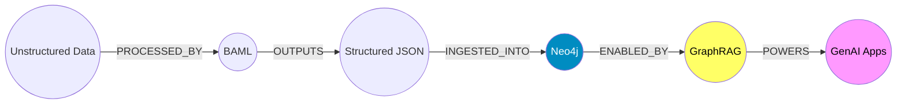

# Structuring the Unstructured: A Practical Guide to BAML & Neo4j

## Building Reliable Knowledge Graph Pipelines with Deterministic AI

### The Analyst's Dilemma

Consider the role of a senior intelligence analyst at a financial firm. You are inundated with thousands of unstructured documents: quarterly reports, news articles, and internal memos. Your objective is to map relationships between market entities to identify potential risks or opportunities.

This represents the fundamental challenge of unstructured data. To derive actionable insights, you need to transform this raw text into a structured network. You need to know that Company A (mentioned in a news article) is ACQUIRING Startup B (mentioned in a press release). In architectural terms, you need to move from a Data Lake of text documents to a Knowledge Graph stored in Neo4j.

In this architecture:
- **The Input**: Unstructured web pages, PDFs, and text.
- **The Processor**: A Large Language Model (LLM).
- **The Storage**: Neo4j (Graph Database).

### The Engineering Challenge: Non-Deterministic Outputs

Attempting to build this pipeline with standard LLM prompts often leads to failure in production. If you ask a generic model to "extract entities," the output varies significantly between runs.

- **Run 1**: The model returns a JSON object with a "name" field.
- **Run 2**: The model returns a list of strings.
- **Run 3**: The model hallucinates a field that is not in your database schema.

For a data engineer, this inconsistency is unacceptable. You cannot build a reliable ETL pipeline if the transformation layer is unpredictable. You need a mechanism to enforce strict schema compliance before the data ever touches your database.

This is the specific problem BAML solves.

### The Tech Stack

- **Source**: Unstructured text data.
- **Validation Layer (BAML)**: A domain-specific language that enforces structured outputs from LLMs, treating prompts as typed functions.
- **Storage Layer (Neo4j)**: A graph database designed to store and query complex relationships.

### The Architecture

The following workflow demonstrates the pipeline:

```mermaid
flowchart TD
    A[Unstructured Web Page] -->|Raw Text| B(Python Controller)
    B -->|Input| C{BAML Runtime}
    C -->|Schema & Prompt| D[LLM (GPT-4/Claude)]
    D -->|Raw Output| C
    C -->|Validation & Repair| C
    C -->|Typed Object| E[Structured Graph Data]
    E -->|Cypher Transaction| F[(Neo4j Database)]

    style C fill:#f96,stroke:#333,stroke-width:2px
    style F fill:#69b3a2,stroke:#333,stroke-width:2px
```

### Implementation Guide

In this example, we will build a pipeline to parse a technical blog post and extract Products and Use Cases, linking them via relationships.

#### Step 1: Defining the Schema with BAML

BAML (Boundary Abstract Model Language) allows us to define the expected data structure formally. This treats the LLM prompt as a function with a guaranteed return type.

```baml
// Define the Node structure
class Node {
  id: string
  label: string @description("The type of entity, e.g., 'Product', 'Organization'")
  properties: map<string, string>
}

// Define the Edge structure
class Edge {
  source_id: string
  target_id: string
  relationship_type: string @description("The predicate, e.g., 'ENABLES', 'DEPENDS_ON'")
}

// Define the complete Graph structure
class KnowledgeGraph {
  nodes: Node[]
  edges: Edge[]
}

// The Extraction Function
function ExtractGraph(text: string) -> KnowledgeGraph {
  client GPT4
  prompt #"
    Analyze the following text and extract a knowledge graph based on the defined schema.

    TEXT:
    {{ text }}

    Ensure strict adherence to the schema classes defined.
  "#
}
```

The key advantage here is type safety. If the model attempts to return a relationship type as an integer, the BAML runtime intercepts the error and can either self-correct or raise a structured exception.

#### Step 2: The Extraction Pipeline

We use a Python script to orchestrate the process: fetching data, invoking the BAML function, and handling the response.

```python
import html2text
from baml_client import b

# 1. Data Ingestion
url = "https://neo4j.com/blog/target-article"
raw_html = fetch_url(url)

# 2. Pre-processing
clean_text = html2text.html2text(raw_html)

# 3. Structured Extraction
# The b.ExtractGraph call guarantees the return type matches our BAML class
graph_data = b.ExtractGraph(clean_text)

print(f"Extraction complete. Found {len(graph_data.nodes)} nodes.")
```

#### Step 3: Why Validation Matters

Without a tool like BAML, downstream code is often littered with try/except blocks handling various malformed JSON structures. By moving validation to the prompt engineering layer, we ensure that the Python application receives clean, typed objects every time. It effectively turns the probabilistic nature of an LLM into a deterministic function call.

#### Step 4: Ingestion into Neo4j

With verified data in hand, we load it into Neo4j using Cypher. We use MERGE statements to ensure idempotency—running the script twice won't create duplicate nodes.

```python
from neo4j import GraphDatabase

def upload_to_neo4j(graph_data):
    driver = GraphDatabase.driver("bolt://localhost:7687", auth=("neo4j", "password"))

    with driver.session() as session:
        # 1. Merge Nodes
        for node in graph_data.nodes:
            session.run("""
                MERGE (n:Entity {id: $id})
                SET n.label = $label, n += $props
            """, id=node.id, label=node.label, props=node.properties)

        # 2. Merge Relationships
        for edge in graph_data.edges:
            session.run("""
                MATCH (source:Entity {id: $source_id})
                MATCH (target:Entity {id: $target_id})
                MERGE (source)-[:$rel_type]->(target)
            """, source_id=edge.source_id,
                 target_id=edge.target_id,
                 rel_type=edge.relationship_type)
```

### The Outcome

Executing this pipeline against a dataset of documents results in a traversable graph. Visualization in Neo4j Bloom or the Browser would reveal the connectivity between disparate entities.



### Strategic Value

Implementing this architecture provides three core benefits to the enterprise:

- **Data Integrity**: We eliminate the risk of malformed data entering the system, reducing maintenance overhead.
- **Scalability**: The pipeline can process high volumes of documents without manual oversight.
- **Insight Discovery**: By converting text to a graph, we enable complex query patterns—such as pathfinding and community detection—that are impossible with simple text search.

### Conclusion

Building a knowledge graph is a rigorous process of translating unstructured human language into structured machine logic. By leveraging BAML for strict type enforcement and Neo4j for relationship storage, we create a robust, production-ready pipeline that turns information into intelligence.